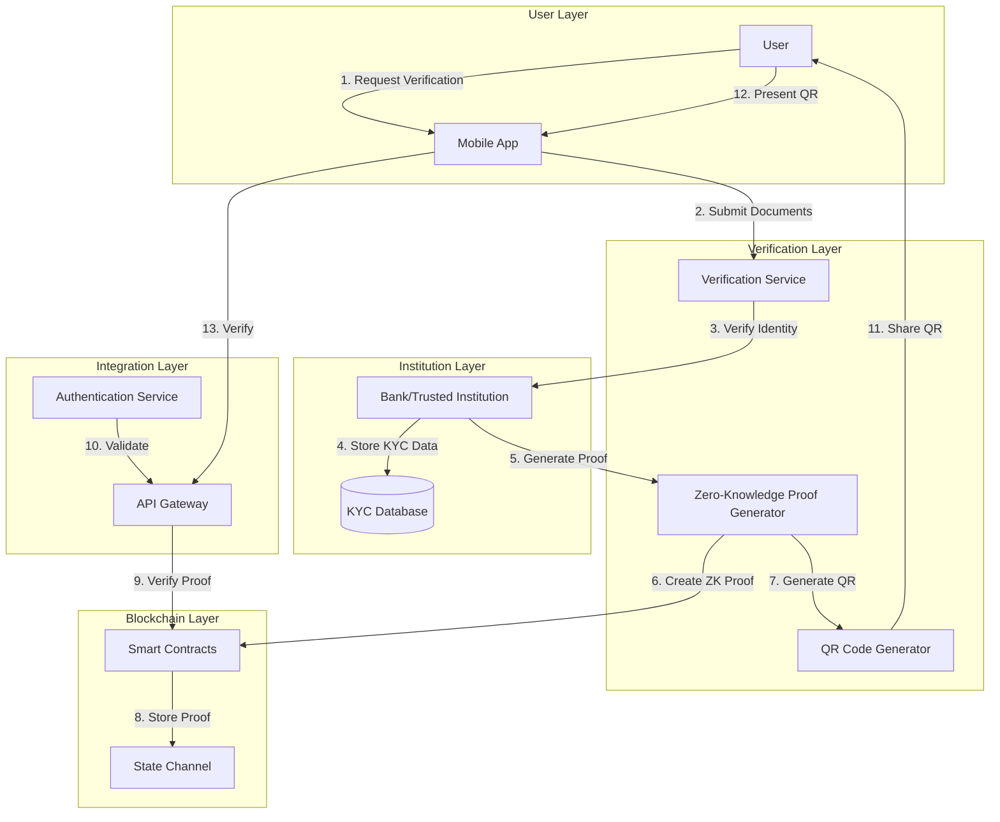

# System Architecture

## High-Level Architecture

## Component Description

### User Layer
- **User**: End-user requiring KYC verification
- **Mobile App**: Interface for users to interact with the system

### Verification Layer
- **Verification Service**: Handles the verification process
- **Zero-Knowledge Proof Generator**: Creates privacy-preserving proofs
- **QR Code Generator**: Generates verifiable QR codes

### Institution Layer
- **Bank/Trusted Institution**: Primary verifier of user identity
- **KYC Database**: Secure storage for verified KYC data

### Blockchain Layer
- **Smart Contracts**: Manages verification proofs and permissions
- **State Channel**: Handles off-chain verification states

### Integration Layer
- **API Gateway**: Provides unified interface for verification
- **Authentication Service**: Manages access control and security

## Data Flow

1. User initiates verification through mobile app
2. Documents submitted to verification service
3. Bank verifies identity and documents
4. KYC data stored securely
5. Zero-knowledge proof generated
6. Proof stored on blockchain
7. QR code generated for user
8. User can present QR code for verification
9. API verifies proof through blockchain
10. Authentication service validates request

## Security Considerations

- All sensitive data is encrypted at rest and in transit
- Zero-knowledge proofs ensure privacy
- Blockchain provides immutable verification records
- Multi-factor authentication for all services
- Regular security audits and compliance checks 